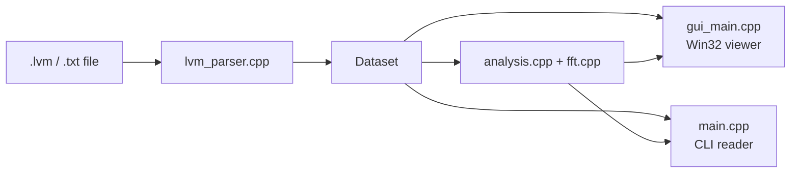

# LVM Graph Viewer


**[Русский](README_RU.md)** | **[English](README_EN.md)**

Native C++ toolkit for viewing and analysing LabVIEW signal files `.lvm` / `.txt`.

It combines:

- `lvm_viewer_gui.exe` — a dependency-free Win32 desktop viewer;
- `lvm_reader.exe` — a CLI tool for inspection, statistics, FFT, and export.

The project shares one parser + FFT + analysis core across both front ends, so GUI and CLI behaviour stay consistent.

## At A Glance

| Item | Value |
|------|-------|
| Version | `v0.8.0` |
| Language | `C++17` |
| GUI stack | Win32 API + GDI / GDI+ |
| Build | `MSYS2/MinGW g++` |
| FFT | Radix-2 + Bluestein |
| Export | PNG, CSV |
| Languages | English, Russian |
| Validation | Checked against the Python reference and `numpy.rfft` |

## Why It Is Useful

| Use case | What you get |
|----------|--------------|
| Interactive review | Time plots, FFT mode, zoom/pan, playhead playback, interactive legend |
| Measurement work | Snapped points, `X`, `Y`, `Δx`, `Δy`, `1/Δt`, distance, coloured markers |
| Visual context | Dark theme, minor grid, guide lines, markers, welcome screen, RU/EN UI |
| Signal export | Visible-segment CSV export and PNG screenshots |
| Batch / terminal work | File info, per-channel stats, head output, FFT peaks, FFT CSV |

## Architecture



## GUI Viewer

The GUI is a native Win32 application with no Qt and no extra runtime dependencies.

### Main Features

- Time-domain and FFT views in the same window.
- Interactive multi-channel legend: click to toggle, `Ctrl+Click` to solo.
- Channel panel with visibility checkboxes.
- Zoom and pan on both axes.
- Real-time playback with a moving playhead.
- Measurement mode with on-chart read-outs.
- Vertical / horizontal guide lines and labelled markers.
- Drag & drop file opening.
- Inline channel rename in the channel list.
- Unified settings window for language, hotkeys, markers, and point display.
- Signal transform controls with global and per-channel multiplier / offset.
- Dark theme and live RU/EN language switching.
- PNG export and CSV export.

### Measurement Options

The measurement settings panel can show any combination of:

- point number;
- `X` coordinate;
- `Y` coordinate;
- `Δx`;
- `Δy`;
- `1/Δt`;
- straight-line distance.

Markers can also snap to real samples, which is especially useful on dense traces.

### Keyboard Shortcuts

| Key | Action |
|-----|--------|
| `O` / `Ctrl+O` | Open file |
| `S` / `Ctrl+S` | Save PNG |
| `E` / `Ctrl+E` | Save CSV |
| `M` | Toggle Time / Hz |
| `Space` | Play / Pause |
| `V` | Toggle measurement mode |
| `C` | Toggle spline smoothing |
| `+` / `Up` | Zoom in |
| `-` / `Down` | Zoom out |
| `Left` / `Right` | Pan left / right |
| `Home` | Reset view |
| `Ctrl+Home` | Go to start |
| `Ctrl+End` | Go to end |
| `P` | Toggle vertical panning |
| `Delete` | Clear measurement points |
| `Esc` | Cancel pending line / marker placement |
| `T` | Toggle theme |
| `F1` | Show shortcuts help |
| `Ctrl+Z` | Undo |
| `Ctrl+Shift+Z` | Redo |

Mouse:

- wheel — zoom under cursor;
- `Shift + wheel` — pan horizontally;
- `Ctrl + wheel` — zoom vertically;
- `Alt + wheel` — pan vertically;
- left-drag — pan;
- left-click — place point / line / marker in the current mode;
- right-click — clear measurement points.

## CLI Usage

The CLI is useful when you want quick inspection or scripted export without opening the GUI.

### Build

Using the Makefile:

```bash
make
make test
```

Or directly:

```bash
g++ -std=c++17 -O2 -static -o lvm_reader.exe \
    main.cpp lvm_parser.cpp fft.cpp analysis.cpp
```

### Example Commands

```bash
# Default: file structure + per-channel statistics
./lvm_reader.exe lvm_files_for_tests/test.lvm

# First 5 rows
./lvm_reader.exe lvm_files_for_tests/test.lvm --head 5

# CSV export for a selected time window
./lvm_reader.exe lvm_files_for_tests/test.lvm --start 0 --end 0.5 --channels 1 --csv window.csv

# Strongest FFT peaks
./lvm_reader.exe lvm_files_for_tests/test.lvm --fft --peaks 3

# Rebuild a monotonic timeline for multi-section files
./lvm_reader.exe lvm_files_for_tests/test1.lvm --info --monotonic
```

### Supported Actions

| Flag | Meaning |
|------|---------|
| `--info` | Show file structure and parser statistics |
| `--stats` | Show min / max / mean / count per channel |
| `--head N` | Print the first `N` rows |
| `--csv FILE` | Export selected data to CSV |
| `--fft` | Show strongest spectral peaks |
| `--fft-csv FILE` | Export the magnitude spectrum |
| `--channels LIST` | Select 1-based channel positions |
| `--start T`, `--end T` | Restrict the time window |
| `--monotonic` | Rebuild a strictly increasing time axis |
| `--keep-dup-time` | Keep channels that duplicate the time axis |
| `--fft-samples N` | Cap FFT input size by uniform decimation |

## Build The GUI

Recommended helper:

```powershell
powershell -ExecutionPolicy Bypass -File build_gui.ps1
```

Direct command:

```bash
g++ -std=c++17 -O2 -municode -static -mwindows -o lvm_viewer_gui.exe \
    gui_main.cpp lvm_parser.cpp fft.cpp analysis.cpp \
    -lcomdlg32 -lgdi32 -luser32 -lgdiplus -lcomctl32
```

## Project Layout

| File | Purpose |
|------|---------|
| `gui_main.cpp` | Entire Win32 GUI viewer |
| `main.cpp` | CLI front-end |
| `lvm_parser.cpp` / `lvm_parser.hpp` | File parser |
| `analysis.cpp` / `analysis.hpp` | Spectrum + peak detection |
| `fft.cpp` / `fft.hpp` | FFT implementation |
| `tests/run_tests.cpp` | Regression tests |
| `build_gui.ps1` | PowerShell GUI build helper |
| `Makefile` | Build targets for CLI, tests, and GUI |

<details>
<summary>Parsing and spectrum behaviour</summary>

### Parsing

- Metadata lines and `***` separators are ignored.
- Decimal commas are normalised to dots.
- A row needs at least two numeric values to count as data.
- Invalid / missing cells become `NaN`, so channel alignment is preserved.
- The first column is treated as time / X.
- Duplicate time-axis channels are removed by default.

### Spectrum

- Sample spacing is derived from the median positive time step.
- Signals are mean-removed before FFT.
- Bluestein FFT allows arbitrary lengths.
- `--fft-samples` uses uniform decimation to keep the frequency axis meaningful.
- `v0.5.1` fixes the scaling of FFT edge bins such as Nyquist.

</details>

## Changelog

### v0.8.0

- Rebuilt the welcome screen into a clearer two-panel start page with direct RU/EN language selection.
- Added a unified settings window for language, hotkeys, markers, and measurement read-outs.
- Moved channel renaming into the channel list for direct in-place editing.
- Added signal value transforms with global and per-channel multiplier / offset controls.
- Fixed UTF-8 handling in the Windows GUI build so Russian interface text renders correctly.

### v0.5.1

- Strict monotonic rebuild for equal neighbouring timestamps.
- Correct FFT scaling on DC / Nyquist edge bins.
- Explicit rejection of invalidly small `--fft-samples`.
- Safer CLI parsing for numeric arguments.

### v0.5.0

- Drag & drop opening.
- Channel rename dialog.
- Go to start / end shortcuts.
- Vertical panning and `Alt + wheel` support.

### v0.4.4

- Deeper zoom.
- Fixed measurement read-outs.
- Filled measurement dots.
- FFT spline smoothing.
