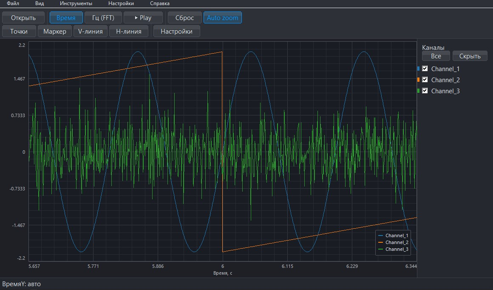
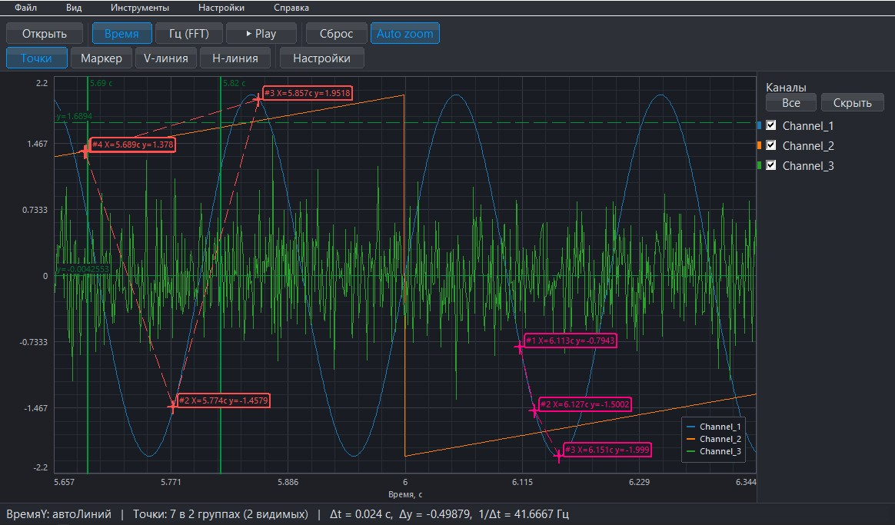

# LVM Graph Viewer

<p align="center">
  
</p>

Нативный Win32-просмотрщик и CLI-инструмент для работы с файлами сигналов LabVIEW `.lvm` / `.txt`.

## Зачем нужен проект

`LVM Graph Viewer` сделан для быстрой инженерной работы с логами LabVIEW без тяжёлых внешних зависимостей:

- без Qt
- без отдельного GUI-runtime
- без сложной установки
- с быстрым открытием реальных измерительных файлов
- с удобным интерактивным просмотром и CLI-режимом

## Основные возможности

### Desktop-приложение

- просмотр сигнала во времени и в режиме FFT
- масштабирование, панорамирование, playback и auto zoom
- светлая и тёмная тема
- русский и английский интерфейс
- переименование каналов прямо в списке
- экспорт PNG, CSV и TXT
- drag & drop открытия файла

### Измерения и анализ

- примагничиваемые точки измерения
- независимые группы точек со своим цветом и видимостью
- отображение `X`, `Y`, `Δx`, `Δy`, `1/Δt` и расстояния
- вертикальные и горизонтальные направляющие
- маркеры
- undo/redo для точек, линий и маркеров

### CLI-режим

- структура файла и информация парсера
- статистика по каналам
- экспорт в CSV
- просмотр FFT-пиков
- обработка выбранного временного окна

## Скриншоты интерфейса

| Основное рабочее окно | Группы точек в работе |
|---|---|
|  |  |

## Превью данных

| Time-режим | FFT-режим |
|---|---|
|  |  |

| Группы точек |
|---|
|  |

Скриншоты выше показывают реальный интерфейс программы.
Превью графиков ниже построены по реальным данным из папки [`lvm_files_for_tests`](lvm_files_for_tests).

## Быстрый старт

### Готовая сборка

Откройте [последний релиз](https://github.com/almuleev/LVM-graph-viewer/releases/latest) и скачайте Windows `.exe`.

### Сборка GUI

```powershell
powershell -ExecutionPolicy Bypass -File .\build_gui.ps1
```

### Сборка CLI

```bash
make
```

### Запуск тестов

```bash
make test
```

## Техническая основа

- Язык: `C++17`
- GUI-стек: `Win32 API + GDI/GDI+`
- Рекомендуемый toolchain под Windows: `MSYS2 / MinGW g++`
- Имя GUI-бинарника берётся из текущего git-тега через `build_gui.ps1`

## Структура репозитория

| Путь | Назначение |
|---|---|
| `gui_main.cpp` | Нативный GUI |
| `main.cpp` | CLI-вход |
| `lvm_parser.cpp/.hpp` | Парсер `.lvm` / `.txt` |
| `analysis.cpp/.hpp` | Аналитические helper-функции |
| `fft.cpp/.hpp` | FFT-ядро |
| `tests/run_tests.cpp` | Регрессионные тесты |
| `docs/assets/` | Визуалы для GitHub |
| `docs/PROJECT_CONTEXT.md` | Расширенный технический контекст |

## Связанные файлы

- [Основной README](README.md)
- [English README](README_EN.md)
- [История изменений](CHANGELOG.md)
- [Лицензия MIT](LICENSE)
