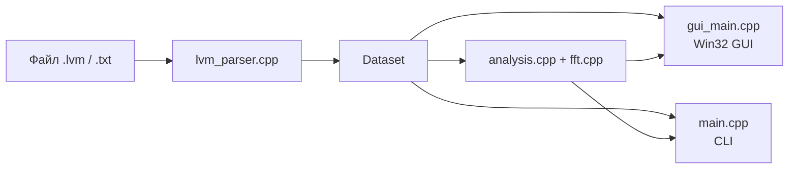

# LVM Graph Viewer


**[Русский](README_RU.md)** | **[English](README_EN.md)**

Нативный C++-инструмент для просмотра и анализа сигналов LabVIEW в файлах `.lvm` / `.txt`.

Проект состоит из двух фронтендов:

- `lvm_viewer_gui.exe` — автономный Win32 GUI-просмотрщик;
- `lvm_reader.exe` — консольный инструмент для структуры, статистики, БПФ и экспорта.

Оба режима используют одно общее ядро: парсер, FFT и анализ, поэтому поведение GUI и CLI согласовано.

## Кратко О Проекте

| Пункт | Значение |
|------|----------|
| Версия | `v0.8.1` |
| Язык | `C++17` |
| GUI | Win32 API + GDI / GDI+ |
| Сборка | `MSYS2/MinGW g++` |
| FFT | Radix-2 + Bluestein |
| Экспорт | PNG, CSV |
| Языки интерфейса | Русский, English |
| Проверка точности | Сверено с Python-референсом и `numpy.rfft` |

## Что Здесь Есть

| Сценарий | Что получает пользователь |
|----------|---------------------------|
| Интерактивный просмотр | График сигнала, FFT-режим, масштабирование, панорамирование, playhead, интерактивная легенда |
| Измерения | Точки с привязкой к данным, `X`, `Y`, `Δx`, `Δy`, `1/Δt`, расстояние, цветные маркеры |
| Визуальный контекст | Тёмная тема, мелкая сетка, направляющие линии, маркеры, welcome screen, RU/EN интерфейс |
| Экспорт | CSV видимого диапазона и PNG снимок графика |
| Работа из терминала | Информация о файле, статистика по каналам, первые строки, пики FFT, экспорт спектра |

## Архитектура



## GUI-Просмотрщик

GUI — это нативное Win32-приложение без Qt и без внешних runtime-зависимостей.

### Основные Возможности

- просмотр сигнала во времени и в FFT-режиме;
- интерактивная легенда каналов: клик — скрыть/показать, `Ctrl+Клик` — solo;
- панель каналов с чекбоксами;
- масштабирование и панорамирование по обеим осям;
- воспроизведение сигнала в реальном времени;
- режим измерений с подписями прямо на графике;
- вертикальные и горизонтальные направляющие линии;
- именованные маркеры;
- drag & drop открытия файла;
- переименование каналов прямо в списке каналов;
- единое окно настроек для языка, горячих клавиш, маркеров и подписей измерений;
- преобразование значений сигнала через общие и поканальные множители / слагаемые;
- тёмная тема и живое переключение RU/EN;
- экспорт PNG и CSV.

### Настройки Измерений

Панель настроек точек измерения позволяет включать и выключать:

- номер точки;
- координату `X`;
- координату `Y`;
- `Δx`;
- `Δy`;
- `1/Δt`;
- расстояние по прямой.

Дополнительно можно включить привязку маркеров к реальным отсчётам и выбрать цвет маркеров.

### Горячие Клавиши

| Клавиша | Действие |
|---------|----------|
| `O` / `Ctrl+O` | Открыть файл |
| `S` / `Ctrl+S` | Сохранить PNG |
| `E` / `Ctrl+E` | Сохранить CSV |
| `M` | Переключить Время / Гц |
| `Пробел` | Play / Pause |
| `V` | Включить / выключить режим точек |
| `C` | Переключить сплайн-сглаживание |
| `+` / `Up` | Приблизить |
| `-` / `Down` | Отдалить |
| `Left` / `Right` | Сдвиг влево / вправо |
| `Home` | Сбросить вид |
| `Ctrl+Home` | Перейти в начало |
| `Ctrl+End` | Перейти в конец |
| `P` | Переключить вертикальное панорамирование |
| `Delete` | Очистить точки измерения |
| `Esc` | Отменить добавление линии / маркера |
| `T` | Переключить тему |
| `F1` | Показать справку по клавишам |
| `Ctrl+Z` | Отменить |
| `Ctrl+Shift+Z` | Повторить |

Мышь:

- колесо — масштаб под курсором;
- `Shift + колесо` — горизонтальная прокрутка;
- `Ctrl + колесо` — масштаб по вертикали;
- `Alt + колесо` — вертикальный сдвиг;
- тяга ЛКМ — панорамирование;
- ЛКМ — поставить точку / линию / маркер в активном режиме;
- ПКМ — очистить точки измерения.

## CLI-Инструмент

CLI удобен, когда нужно быстро проверить файл или получить экспорт без запуска GUI.

### Сборка

Через Makefile:

```bash
make
make test
```

Или напрямую:

```bash
g++ -std=c++17 -O2 -static -o lvm_reader.exe \
    main.cpp lvm_parser.cpp fft.cpp analysis.cpp
```

### Примеры Команд

```bash
# По умолчанию: структура файла + статистика по каналам
./lvm_reader.exe lvm_files_for_tests/test.lvm

# Первые 5 строк
./lvm_reader.exe lvm_files_for_tests/test.lvm --head 5

# CSV для выбранного временного окна
./lvm_reader.exe lvm_files_for_tests/test.lvm --start 0 --end 0.5 --channels 1 --csv window.csv

# Самые сильные пики FFT
./lvm_reader.exe lvm_files_for_tests/test.lvm --fft --peaks 3

# Перестроить время для многоcекционного файла
./lvm_reader.exe lvm_files_for_tests/test1.lvm --info --monotonic
```

### Поддерживаемые Действия

| Флаг | Назначение |
|------|------------|
| `--info` | Структура файла и статистика парсера |
| `--stats` | Минимум / максимум / среднее / count по каналам |
| `--head N` | Первые `N` строк |
| `--csv FILE` | Экспорт выбранных данных в CSV |
| `--fft` | Сильнейшие спектральные пики |
| `--fft-csv FILE` | Экспорт спектра в CSV |
| `--channels LIST` | Выбор каналов по 1-based индексам |
| `--start T`, `--end T` | Ограничение временного окна |
| `--monotonic` | Перестроить строго возрастающую временную шкалу |
| `--keep-dup-time` | Не удалять каналы-дубликаты оси времени |
| `--fft-samples N` | Ограничить число отсчётов для FFT равномерным прореживанием |

## Сборка GUI

Рекомендуемый способ:

```powershell
powershell -ExecutionPolicy Bypass -File build_gui.ps1
```

Прямая команда:

```bash
g++ -std=c++17 -O2 -municode -static -mwindows -o lvm_viewer_gui.exe \
    gui_main.cpp lvm_parser.cpp fft.cpp analysis.cpp \
    -lcomdlg32 -lgdi32 -luser32 -lgdiplus -lcomctl32
```

## Структура Проекта

| Файл | Назначение |
|------|------------|
| `gui_main.cpp` | Весь Win32 GUI |
| `main.cpp` | Консольный фронтенд |
| `lvm_parser.cpp` / `lvm_parser.hpp` | Парсер файлов |
| `analysis.cpp` / `analysis.hpp` | Спектр и поиск пиков |
| `fft.cpp` / `fft.hpp` | FFT-реализация |
| `tests/run_tests.cpp` | Регрессионные тесты |
| `build_gui.ps1` | PowerShell-скрипт сборки GUI |
| `Makefile` | Сборка CLI, тестов и GUI |

<details>
<summary>Примечания по парсингу и FFT</summary>

### Парсинг

- Метаданные и строки `***` пропускаются.
- Десятичные запятые нормализуются в точки.
- Чтобы строка считалась данными, в ней должно быть минимум два числовых значения.
- Пустые и некорректные ячейки становятся `NaN`, сохраняя выравнивание каналов.
- Первый столбец трактуется как время / `X`.
- Каналы, дублирующие ось времени, по умолчанию удаляются.

### Спектр

- Шаг дискретизации берётся из медианы положительных шагов времени.
- Перед FFT сигнал центрируется по среднему.
- Bluestein FFT позволяет работать с любым `N`.
- `--fft-samples` использует равномерное прореживание, чтобы сохранить осмысленную частотную ось.
- В `v0.5.1` исправлено масштабирование краевых FFT-бинов, включая Nyquist.

</details>

## История Версий

### v0.8.1

- Исправлены оставшиеся битые русские подписи в меню и окне настроек.
- Доработано отображение активных кнопок и унифицировано имя `Авто масштабирование`.
- Крайние подписи осей теперь остаются внутри области графика и не наезжают на соседний UI.
- Выбор скорости воспроизведения упрощён до прямого ввода собственного числового значения.
- Welcome screen очищен от лишнего декора, а подпись внизу приведена к аккуратному виду.

### v0.8.0

- Welcome screen полностью переработан: теперь это аккуратная стартовая страница с прямым выбором RU/EN.
- Добавлено единое окно настроек для языка, горячих клавиш, маркеров и параметров отображения точек.
- Переименование каналов перенесено в сам список каналов и работает как inline-редактирование.
- Добавлены преобразования значений сигнала через общий и индивидуальный для канала множитель / слагаемое.
- Исправлена UTF-8 сборка Windows-версии, из-за чего русский текст интерфейса снова отображается корректно.

### v0.5.1

- Строго монотонная временная шкала при `--monotonic`, включая равные соседние timestamp.
- Корректный коэффициент для DC / Nyquist FFT-бинов.
- Явная ошибка для слишком маленьких значений `--fft-samples`.
- Более надёжный разбор числовых аргументов CLI.

### v0.5.0

- Drag & drop открытия файла.
- Переименование каналов.
- Быстрый переход к началу и концу.
- Вертикальное панорамирование и поддержка `Alt + колесо`.

### v0.4.4

- Более глубокое приближение.
- Исправленные подписи измерений.
- Заполненные точки измерений.
- Сплайн-сглаживание в FFT-режиме.
